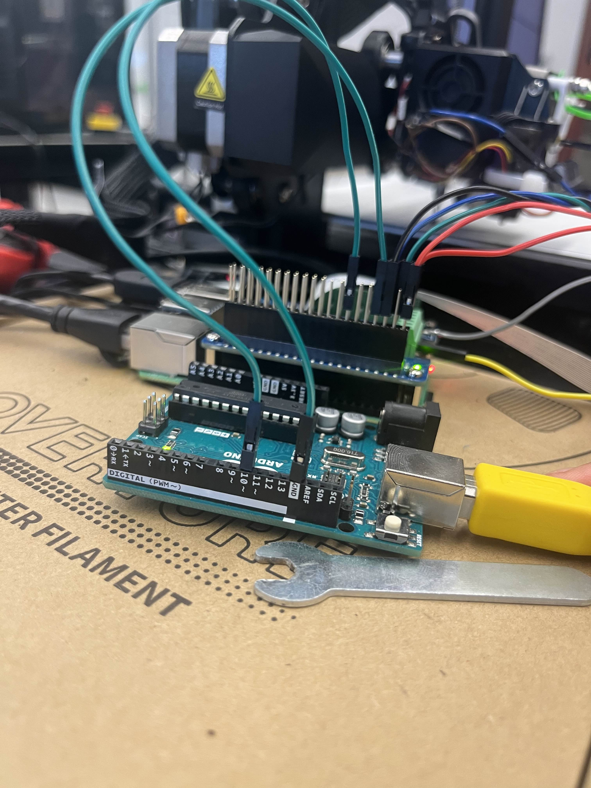
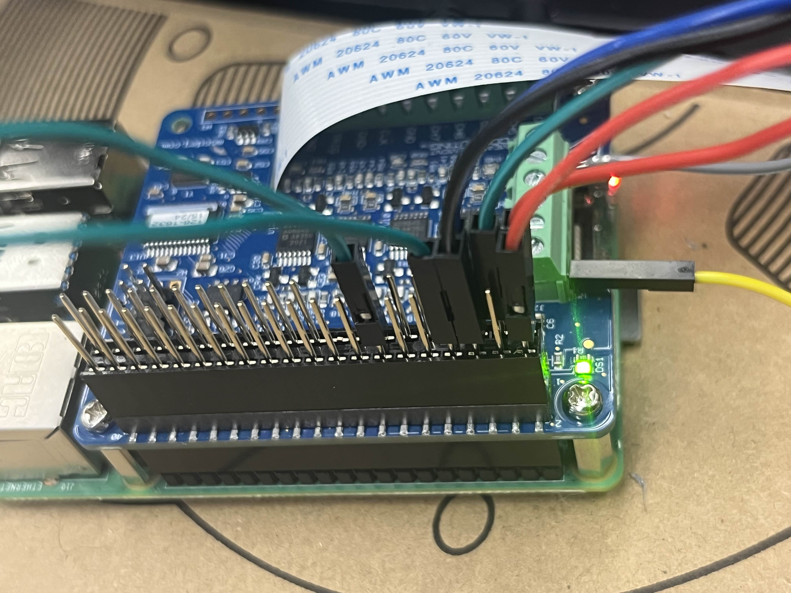

# DualDT4Quality Unity & Dashboard Documentation

## Cloning Unity Guide

1. Clone the Unity project:
   ```bash
   git clone https://github.com/DIIM-Lab/DualDT4Quality/tree/main/S25-USRA-FDMDigitalTwin-Unity.git
   ```
2. Open **Unity Hub**.
3. Add the cloned directory to Unity Hub.
4. Open the project — Unity will automatically fetch required dependencies.
5. Connect the local device to the **Arduino**.
6. Enter Play Mode in Unity (click **Start**).
7. Start the simulation using Sebastian Valencia’s Raspberry Pi setup instructions.

---

## Cloning Dashboard Guide _(Optional)_

> ⚠️ Only needed for development **without** Raspberry Pi. Otherwise, use the Pi-hosted version per Sebastian Valencia’s instructions.

1. Clone the Dashboard repo:
   ```bash
   git clone https://github.com/DIIM-Lab/DualDT4Quality/tree/main/FDM-Dashboard.git
   ```
2. Open with your preferred IDE (e.g. VS Code).

3. In `FDM-Dashboard/server`, create a `.env` file:

   ```env
   CONNECTION_KEY = SEE OFFICIAL FILE
   ```

4. In `FDM-Dashboard/client`, create a `.env` file:

   ```env
   REACT_APP_TOKEN = SEE OFFICIAL FILE
   REACT_APP_PROTOCOL = SEE OFFICIAL FILE
   ```

5. Modify appropriate lines to ensure local development:

   - Uncomment: _TBD ADD LINES HERE_
   - Comment out: _TBD ADD LINES HERE_

6. (Optional) Simulate server communication by sending test data.

7. Start the server:
   ```bash
   npm install
   venv\Scripts\activate     # Optional
   node server.js
   ```

---

## Unity Assets Overview

- **Scenes**: Simulated printer environment.
- **Scripts**: C# logic for printer and interactions.
- **Creality 3D Printer**: Blender model (`v3 0origion.fbx`).

---

## Hardware Setup

### Arduino Wiring

> **Female-to-Female jumper wires used**
> [Arduino Wiring]
> 

---

### Raspberry Pi Wiring

> **Female-to-Female jumper wires used**
> [Raspberry Pi Wiring]
> 

---

## Connection Guide

1. Pi Pin 14 (GND) → Arduino GND
2. Pi Pin 8 (TX) → Arduino Pin 10 (RX)
3. Connect USB Type-B from Arduino to local device.

### Arduino_Sniffer

- Handles serial communication from Pi to Unity.
- Key Pins:
  - Pin 10 (RX) ← Pi TX (Safe)
  - Pin 11 (TX) → ❌ **Do not connect to Pi** (5V to 3.3V not tolerated)
  - GND: Ground
- Baud Rate:
  - PC: `115200`
  - Pi: `38400`

---

## Code Breakdown – Unity (Scripts)

### `ParseGCode.cs`

#### Imports

```csharp
using UnityEngine;
using System;
using System.IO;
using System.Collections;
using System.Collections.Generic;
```

#### Highlights

- **Dictionaries**: Map G-code commands to Unity axis.
- **Axis Swap**: Unity uses Y for Z movements.
- **Queue**: Used to sequence multiple commands.
- **Lists**: Track `activeCommands`, `completed`, and grouped axes.

#### Start()

- Disables gravity and physics to prevent conflicts with G-code behavior.

#### Update()

- Switches between file and serial input based on Pi connection.

#### FixedUpdate()

- Processes queued commands.

---

## Code Breakdown – FDM Dashboard

### `server/server.js`

#### `updateData(newData)`

- Stores all recent data in `allData.json`.

#### `generateData()`

- Creates sample data during development (if Pi is inactive).

#### Express Routing

- Mostly unused but available between lines **50–81**.
- Adjust `indexPath` depending on environment:
  - Local:
    ```js
    const indexPath = path.join(__dirname, "../client/build/index.html");
    ```
  - Raspberry Pi:
    ```js
    const indexPath = path.join(__dirname, "./build/index.html");
    ```

#### WebSocket Broadcasting

```js
wss.broadcast = function broadcast(data) {
  // Sends to dashboard and other connected clients
};
```

---

## Ignore (Testing/Legacy Files)

- `FolowXAxis.cs`
- `InverseRotation.cs`
- `MovementTest.cs`

---

## Credits

Project by DIIM Lab </br>
Associate Professor: Sheng Yang </br>
Author: Timothy Khan - developed in collaboration with Sebastian Valencia and Mohammad Vahid Ehteshamfar for simulation and dashboard support </br>
